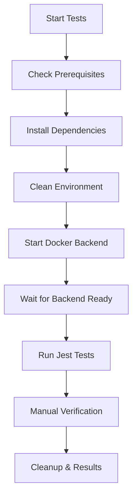

# LocalCA End-to-End Testing Guide

This guide covers the comprehensive end-to-end (E2E) testing system for LocalCA, which tests the complete frontend-backend integration using Docker.

## Overview

The E2E testing system provides:

- **Real Backend Testing**: Uses actual Go backend running in Docker
- **Complete Workflow Testing**: Tests setup, login, certificate management, etc.
- **Frontend-Backend Integration**: Tests API calls, authentication, error handling
- **Cross-Platform Support**: Works on Windows, macOS, and Linux
- **Automated Setup/Teardown**: Handles Docker containers and test data automatically

## Quick Start

### Prerequisites

- Docker and Docker Compose installed
- Node.js and npm installed
- curl (for health checks)

### Running Tests

**Linux/macOS:**
```bash
npm run test:e2e
```

**Windows:**
```bash
npm run test:e2e:windows
```

**Manual Docker approach:**
```bash
# Start the test environment
./run-e2e-tests.sh

# Or on Windows
run-e2e-tests.bat
```

## Test Architecture

### Components

1. **Docker Backend** (`docker-compose.test.yml`)
   - Simplified backend configuration for testing
   - Disabled external services (PostgreSQL, MinIO, KeyDB)
   - Optimized for fast startup and testing

2. **Test Setup** (`test-utils/docker-setup.js`)
   - Docker container management
   - Backend health checking
   - Test data preparation and cleanup

3. **Jest Configuration** (`jest.config.integration.js`)
   - Extended timeouts for Docker startup
   - Global setup/teardown hooks
   - Integration-specific test patterns

4. **Test Files** (`__tests__/integration/`)
   - Complete workflow tests
   - API integration tests
   - Frontend component tests
   - Error handling tests

### Test Flow



## Test Categories

### 1. API Integration Tests

Tests direct backend API endpoints:

```javascript
describe('API Integration Tests', () => {
  it('should handle CA info endpoint', async () => {
    const response = await fetch(`${global.testConfig.backendUrl}/api/ca-info`)
    expect([200, 401]).toContain(response.status)
  })
})
```

**Covered endpoints:**
- `/api/setup` - Initial setup
- `/api/login` - Authentication
- `/api/ca-info` - CA information
- `/api/certificates` - Certificate management
- Error endpoints and malformed requests

### 2. Frontend Component Tests

Tests React components with real backend:

```javascript
describe('Frontend Component Integration', () => {
  it('should render setup page without errors', async () => {
    render(<SetupPage />)
    await waitFor(() => {
      expect(screen.getByText(/LocalCA Initial Setup/i)).toBeInTheDocument()
    })
  })
})
```

**Covered components:**
- Setup page rendering and form submission
- Login page rendering and authentication
- Dashboard loading and error states
- Form validation and user interactions

### 3. Complete Workflow Tests

Tests end-to-end user workflows:

```javascript
describe('Complete Workflow Tests', () => {
  it('should complete the full setup process', async () => {
    // 1. Check setup status
    // 2. Render setup page
    // 3. Fill and submit form
    // 4. Verify completion
  })
})
```

**Covered workflows:**
- Initial setup process
- Login and authentication
- Certificate creation and management
- Error handling and recovery

### 4. Error Handling Tests

Tests system behavior under error conditions:

```javascript
describe('Error Handling', () => {
  it('should handle invalid endpoints gracefully', async () => {
    const response = await fetch(`${backendUrl}/api/nonexistent`)
    expect(response.status).toBe(404)
  })
})
```

**Covered scenarios:**
- Invalid API endpoints
- Malformed requests
- Network timeouts
- Authentication failures
- CORS configuration

## Configuration

### Docker Configuration

**File:** `docker-compose.test.yml`

```yaml
services:
  backend-test:
    build:
      context: .
      dockerfile: Dockerfile
    ports:
      - "8080:8080"
    environment:
      # Simplified configuration for testing
      - DATABASE_ENABLED=false
      - S3_ENABLED=false
      - CACHE_ENABLED=false
      - DEBUG=true
```

### Jest Configuration

**File:** `jest.config.integration.js`

```javascript
module.exports = {
  testTimeout: 120000, // 2 minutes for Docker
  globalSetup: './test-utils/global-setup.js',
  globalTeardown: './test-utils/global-teardown.js',
  setupFilesAfterEnv: ['./jest.setup.integration.js'],
  testMatch: ['**/__tests__/integration/**/*.test.{js,jsx,ts,tsx}']
}
```

### Environment Variables

The test system uses these environment variables:

- `NEXT_PUBLIC_API_URL`: Backend URL for frontend
- `NODE_ENV`: Set to 'test'
- Docker environment variables for backend configuration

## Debugging

### Common Issues

1. **Docker startup timeout**
   ```bash
   # Check Docker status
   docker-compose -f docker-compose.test.yml ps
   
   # View backend logs
   docker-compose -f docker-compose.test.yml logs backend-test
   ```

2. **Port conflicts**
   ```bash
   # Check what's using port 8080
   lsof -i :8080  # macOS/Linux
   netstat -ano | findstr :8080  # Windows
   ```

3. **Test failures**
   ```bash
   # Run with verbose output
   npm run test:integration -- --verbose
   
   # Run specific test file
   npm run test:integration -- complete-workflow.test.tsx
   ```

### Debug Mode

Enable debug mode by setting environment variables:

```bash
export DEBUG=true
export LOG_LEVEL=debug
npm run test:e2e
```

### Manual Testing

You can also test manually while the Docker backend is running:

```bash
# Start backend only
docker-compose -f docker-compose.test.yml up backend-test

# Test endpoints manually
curl http://localhost:8080/api/setup
curl http://localhost:8080/api/ca-info
```

## Best Practices

### Writing Tests

1. **Use descriptive test names**
   ```javascript
   it('should complete setup process with valid credentials', async () => {
   ```

2. **Test both success and failure cases**
   ```javascript
   // Test success
   expect(response.status).toBe(200)
   
   // Test failure
   expect([400, 401, 500]).toContain(response.status)
   ```

3. **Use proper timeouts**
   ```javascript
   await waitFor(() => {
     expect(element).toBeInTheDocument()
   }, { timeout: 10000 })
   ```

4. **Clean up after tests**
   ```javascript
   beforeEach(async () => {
     await global.resetBackendState()
   })
   ```

### Performance

1. **Parallel test execution**: Tests run in parallel where possible
2. **Docker layer caching**: Docker images are cached between runs
3. **Selective cleanup**: Only necessary files are cleaned up

### Reliability

1. **Health checks**: Backend readiness is verified before tests
2. **Retry logic**: Network requests include retry mechanisms
3. **Graceful cleanup**: Resources are cleaned up even on failures

## Troubleshooting

### Backend Won't Start

1. Check Docker is running
2. Verify port 8080 is available
3. Check Docker Compose file syntax
4. Review backend logs for errors

### Tests Timeout

1. Increase Jest timeout in configuration
2. Check backend health endpoint
3. Verify network connectivity
4. Review Docker container status

### Frontend Tests Fail

1. Verify API URL configuration
2. Check component imports
3. Review mock configurations
4. Test components in isolation

### Cleanup Issues

1. Manually stop containers: `docker-compose -f docker-compose.test.yml down`
2. Remove test data: `rm -rf test-data`
3. Clean Docker system: `docker system prune`

## CI/CD Integration

### GitHub Actions Example

```yaml
name: E2E Tests
on: [push, pull_request]

jobs:
  e2e-tests:
    runs-on: ubuntu-latest
    steps:
      - uses: actions/checkout@v3
      - uses: actions/setup-node@v3
        with:
          node-version: '18'
      - run: npm install
      - run: npm run test:e2e
```

### Local Development

```bash
# Run tests before committing
npm run test:e2e

# Run tests in watch mode (manual)
docker-compose -f docker-compose.test.yml up -d
npm run test:integration:watch
```

## Extending Tests

### Adding New Test Cases

1. Create test file in `__tests__/integration/`
2. Follow existing patterns for setup/teardown
3. Use global test utilities
4. Add appropriate timeouts and error handling

### Adding New API Endpoints

1. Add endpoint tests to API integration suite
2. Test both authenticated and unauthenticated access
3. Test error conditions and edge cases
4. Update documentation

### Adding New Components

1. Create component-specific test file
2. Test rendering with real backend data
3. Test user interactions and form submissions
4. Test error states and loading states

## Performance Metrics

The E2E test suite typically:

- **Startup time**: 30-60 seconds (Docker build + backend start)
- **Test execution**: 2-5 minutes (depending on test count)
- **Cleanup time**: 10-20 seconds
- **Total time**: 3-7 minutes for complete suite

## Security Considerations

- Tests use isolated Docker environment
- Test data is cleaned up after execution
- No production credentials or data used
- Network access limited to localhost
- Containers are removed after tests

## Conclusion

The E2E testing system provides comprehensive coverage of LocalCA's functionality, ensuring that frontend and backend work together correctly. It's designed to be reliable, fast, and easy to use for both development and CI/CD environments. 